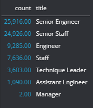
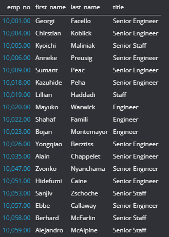
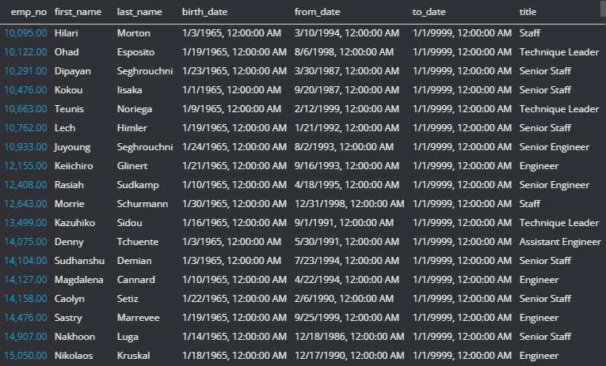
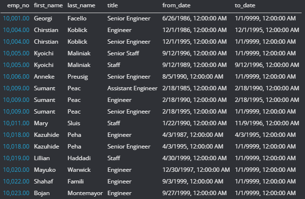

# Pewlett-Hackard-Analisys
## Overview
As many employees approach retirement age, Pewlett Hackard is looking to prepare for the upcoming "silver tsunami". In order to understand the magnitud of this event, and prepare for it. From the data provided we will do the folowwing:
- Create a table with the number of employees retiring and from what departments.
- Create a table with names and titles of soon to be retirees.
- Create a table with employees that are eligibile for mentorship
## Results
- After manipulating the data we found that over 72000 employees will be retiring.  
  
- This will leave a lot of positions to fill  
  
- There are currently 1549 employees eligible employees for mentorship  
  
- There are over 133000 titles that were fulfilled thorught the employment of the future retirees  
  
## Summary
Based on the results, it seems like there will be some challenges ahead to fulfill the positions and to get everyone else up to the task. It may be wise to plan for the future retirees to stay as part-time employees to mentor their replacements and ensure a smoother transition.